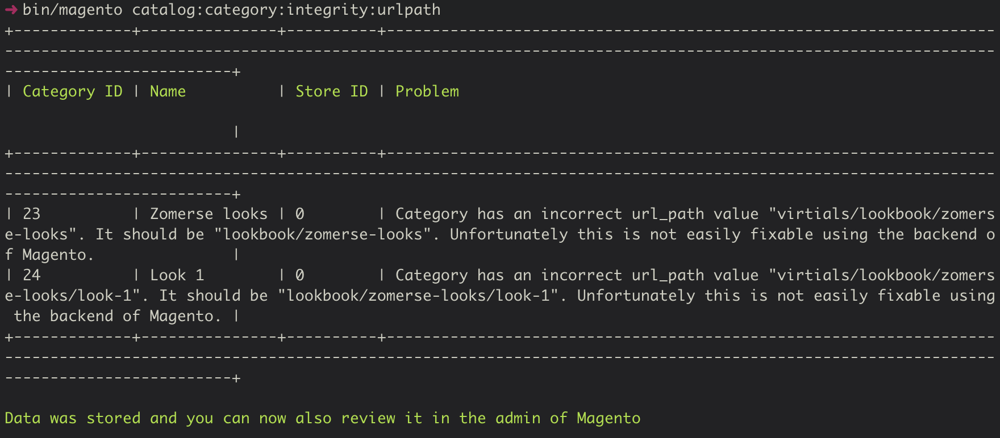

# Url data integrity checker module for Magento 2

## Purpose

The purpose of this module is to give store owners of a Magento 2 shop insight into what url-related problems they have in their products, categories and url rewrites.  
It was explicitly chosen not to have automated fixers for these problems, since fixing these issues can have a significant SEO impact.  
It should be up to the store owner to figure out how he/she wants to fix these problems. Doing this with an automated tool might have a negative impact on SEO rankings, hence why it only reports problems and doesn't try to fix them.

## Implemented features

- It can detect categories having incorrect `url_path` attribute values
- It can detect products having non-empty `url_path` attribute values
- It can detect products having duplicated `url_key` attribute values on the same store view
- It can detect products having an empty `url_key` attribute value

## Roadmap

- Detecting incorrectly generated url rewrites
- Making cronjob execution times configurable
- Increasing performance of checkers, these are currently written for accuracy and not for speed
- Add a legend above the admin grids with a mapping of store view id's with their names
- Improve tests
- Tag stable versions and publish to packagist.org
- ...

## Compatibility

This module should be compatible with Magento 2.1.x, 2.2.x, and 2.3.x versions.  
Some code in this module is using old ways of doing things. It could have been written in a more modern way (using message queues instead of cronjobs, use newer syntax for UI components, ...). But we wanted this module to be compatible with older versions of Magento, so we've chosen this route for now.

The module should be compatible with PHP 7.0, 7.1, 7.2 and 7.3

## Installation

You can use composer to install this module:

```sh
composer config repositories.magento2-module-url-data-integrity-checker vcs https://github.com/baldwin-agency/magento2-module-url-data-integrity-checker
composer require baldwin/magento2-module-url-data-integrity-checker:dev-master
```

Or download the code and put all the files in the directory `app/code/Baldwin/UrlDataIntegrityChecker`

After which you can then activate it in Magento using:

```sh
bin/magento setup:upgrade
```

## Usage

There are some automatic cronjobs running every night at 02u10, 02u20 and 02u30 which will run the various checkers of this module.  
You can also opt to manually refresh one of the checkers in the Magento admin, which will schedule one of the cronjobs to be ran the next minute. You'll have to wait a few minutes (depending on the number of problems and how big your catalog is) before you'll see the results appearing. You'll need to refresh the page yourself btw, it won't happen by itself.

There are also some cli commands you can execute, which will give you instant feedback about found problems, and will also store that data so you can see them in the Magento admin:

- `bin/magento catalog:category:integrity:urlpath`
- `bin/magento catalog:product:integrity:urlkey`
- `bin/magento catalog:product:integrity:urlpath`

In the Magento admin, you can find the results in:

- for Magento 2.1.x: Products > Data Integrity Checker
- for Magento 2.2.x and 2.3.x: Catalog > Data Integrity Checker

The results of the checkers are currently stored in the directory `var/tmp` as `.json` files.

## Some screenshots

### Example of backend report for product url key problems


### Example of cli report for category url path problems


## Contributing

After cloning your fork:

1. Create an `auth.json` file with your credentials for https://repo.magento.com/
1. Run `composer install`
1. Make sure running `make check` doesn't report problems with proposed changes
